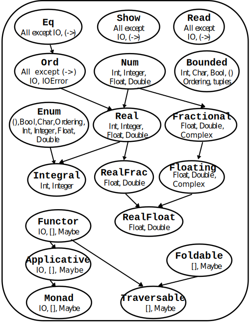

# 🎯 Goals for week 8

1. Practice working with lists and pairs in Haskell.
2. Practice writing high quality code:
   1. Easy to read.
   2. Safe from bugs.
   3. Ready for change.

> 🗿 **Legend**: ⭐ - Easy | 🌟 - Medium | 💫 - Hard

## Haskell Base Classes Hierarchy



## Solving in teams today

As we did last time:

1. Split in teams of at least `2` people.
2. Start solving the tasks on `1` computer.
3. When you are done with one task, call me for feedback. One of you will have to explain the solution.
4. Only then move on to the next task.
5. Iterate. Whichever team is done with all tasks is free to leave the class.
6. Solutions will be uploaded `5` minutes before the end of the session.

## 💫 Task 1

**Description:**

Define the following functions:

- `revOneLine` and `revOneLineMagic`: reverse a whole number;
- `sumDivsOneLineLC` and `sumDivsOneLineHOF`: find the sum of the divisors of a whole number;
- `primeOneLineLC` and `primeOneLineHOF`: check whether a whole number is prime.

**Acceptance criteria:**

1. All tests pass.
2. Valid input is assumed. No parameter validation is done.
3. All functions are defined on a single line.
4. `revOneLineMagic` uses 🪄.
5. `sumDivsOneLineLC` uses list comprehension.
6. `sumDivsOneLineHOF` uses higher order functions.
7. `primeOneLineLC` uses list comprehension.
8. `primeOneLineHOF` uses higher order functions.

**Test cases:**

```haskell
print $ revOneLine 123 == 321
print $ revOneLineMagic 123 == 321

print $ sumDivsOneLineLC 6 == 12
print $ sumDivsOneLineHOF 6 == 12

print $ primeOneLineLC 6 == False
print $ primeOneLineLC 17 == True

print $ primeOneLineHOF 6 == False
print $ primeOneLineHOF 17 == True
```

## 💫 Task 2

**Description:**

Define the following functions:

- `addOneXsPA`: adds `1` to every element in a list of numbers;
- `addOneNPA`: adds `1` to a number using partial function application;
- `sqPlusOne`: squares a number and adds `1` to it.

**Acceptance criteria:**

1. All tests pass.
2. The logic for adding `1` in `addOneXsPA` and in `addOneNPA` is implemented using partial function application.
3. The logic for adding `1` and squaring in `sqPlusOne` is implemented using partial function application.
4. All three functions have a declaration that uses typeclasses.
5. All three functions are defined on a functional level.

**Test cases:**

```haskell
print $ addOneXsPA [1, 2, 3, 4, 5] == [2, 3, 4, 5, 6]
print $ addOneNPA 5 == 6
print $ sqPlusOne 5 == 26
```

## ⭐ Task 3

**Description:**

Define two functions - `getPalindromesLC` and `getPalindromesHOF`, that return the sum of the smallest and largest divisors of a natural number that are palindrome and greater than `1`.

**Acceptance criteria:**

1. All tests pass.
2. `getPalindromesLC` is defined using list comprehension.
3. `getPalindromesHOF` is defined using higher order functions.

**Test cases:**

```haskell
print $ getPalindromesLC 132465 == 8
print $ getPalindromesLC 654546 == 8
print $ getPalindromesLC 100001 == 100012
print $ getPalindromesLC 21612 == 21614
print $ getPalindromesLC 26362 == 26364

print $ getPalindromesHOF 132465 == 8
print $ getPalindromesHOF 654546 == 8
print $ getPalindromesHOF 100001 == 100012
print $ getPalindromesHOF 21612 == 21614
print $ getPalindromesHOF 26362 == 26364
```

## ⭐ Task 4

**Description:**

Define two functions - `sumUnevenLC` and `sumUnevenHOF`, that return the sum of the uneven numbers in a given range.

**Acceptance criteria:**

1. All tests pass.
2. `sumUnevenLC` is defined using list comprehension.
3. `sumUnevenHOF` is defined using higher order functions.

**Test cases:**

```haskell
print $ sumUnevenLC 5 50 == 621
print $ sumUnevenLC 50 1 == 625
print $ sumUnevenLC 564 565 == 565

print $ sumUnevenHOF 5 50 == 621
print $ sumUnevenHOF 50 1 == 625
print $ sumUnevenHOF 564 565 == 565
```

## 🌟 Task 5

**Description:**

Define a function accepts two lists with equal lengths - $xs$ and $ys$, and checks whether there exists a whole number $n$, such that $y_i = n + x_i$.

**Acceptance criteria:**

1. All tests pass.

**Test cases:**

```haskell
print $ isImage [] [] == True
print $ isImage [1, 2, 3] [2, 3, 4] == True
print $ isImage [1, 2, 3] [4, 6, 9] == False
print $ isImage [1, 2, 3] [2, 5, 4] == False
```

## 🌟 Task 6

**Description:**

Define a function that takes a word and returns a list of tuples in the form *(x, xCount)* where for each letter *x*, *xCount* is the number of times it is present in the word. Ignore capitalization.

**Acceptance criteria:**

1. All tests pass.
2. The function is defined on a functional level.

**Test cases:**

```haskell
print $ countOccurrences "Test" == [('e',1),('s',1),('t',2)]
print $ countOccurrences "ThisIsAReallyLongWordContaingAlmostEveryCharacter" == [('a',6),('c',3),('d',1),('e',4),('g',2),('h',2),('i',3),('l',4),('m',1),('n',3),('o',4),('r',5),('s',3),('t',4),('v',1),('w',1),('y',2)]
```

## 💫 Task 7

**Description:**

Define a function that accepts a list of whole numbers and returns a list of lists, such that each list contains a sequence of consecutive numbers.

**Acceptance criteria:**

1. All tests pass.

**Test cases:**

```haskell
print $ pack [1, 2, 3, 7, 8 ,9] == [[1,2,3],[7,8,9]]
print $ pack [1, 7, 8 ,9] == [[1],[7,8,9]]
print $ pack [1, 9] == [[1],[9]]
```

## For home

### 💫 Task 1

**Description:**

Define the following functions that take a list of numbers - $xs$, and a number $n$:

- `addN`: adds $n$ to every element in $xs$;
- `sqAddN`: calculates $(x_i + n)^2$, $x_i \in xs$;
- `divByN`: calculates $x_i$ divided by $n$, $x_i \in xs$. For this function use the following declaration *divByN :: [Int] -> Int -> [Double]* and add a test with a negative $n$.
- `filterByN`: removes all numbers smaller than $n$ from $xs$.

**Acceptance criteria:**

1. Add one new test case for each of the `4` functions. Place a comment after it with the words `my test`.
2. All tests pass.
3. `addN`, `sqAddN` and `filterByN` use typeclasses.
4. Partial function application is used wherever possible.
5. A test with a negative number is present for `divByN`.

**Test cases:**

```haskell
print $ addN [1, 2, 3, 4, 5] 9999999999999999999999 == [10000000000000000000000,10000000000000000000001,10000000000000000000002,10000000000000000000003,10000000000000000000004]
print $ sqAddN [1, 2, 3, 4, 5] 5 == [36,49,64,81,100]
print $ divByN [1, 2, 3, 4, 5] 5 == [0.2,0.4,0.6,0.8,1.0]
print $ filterByN [1, 2, 3, 4, 5] 3 == [3,4,5]
```

### 🌟 Task 2

**Description:**

Define a function *sumSpecialPrimes n d* that returns the sum of the first *n* prime numbers that contain a digit *d*.

**Acceptance criteria:**

1. Add one new test case. Place a comment after it with the words `my test`.
2. All tests pass.
3. Recursion is not used.

**Test cases:**

```haskell
print $ sumSpecialPrimes 5 2 == 392
print $ sumSpecialPrimes 5 3 == 107
print $ sumSpecialPrimes 10 3 == 462
```

### 🌟 Task 3

**Description:**

Define two functions - *mergeLinearRec* and *mergeXs*, that accept two sorted lists and combine them into one that is also sorted.

**Acceptance criteria:**

1. Add one new test case. Place a comment after it with the words `my test`.
2. All tests pass.
3. `mergeLinearRec` is defined using a linearly recursive process.
4. `mergeXs` is not recursive.
5. `mergeXs` is defined on a single line.

**Test cases:**

```haskell
print $ mergeLinearRec [1, 2, 3] [2, 3, 4, 5, 6] == [1, 2, 3, 4, 5, 6]
print $ mergeLinearRec [1, 2, 3] [2] == [1, 2, 3]
print $ mergeLinearRec [1, 2, 3] [7, 8, 9] == [1, 2, 3, 7, 8, 9]
print $ mergeLinearRec [2, 3, 4, 5, 6] [1, 2, 3] == [1,2,3,4,5,6]
print $ mergeLinearRec [2] [1, 2, 3] == [1,2,3]
print $ mergeLinearRec [7, 8, 9] [1, 2, 3] == [1,2,3,7,8,9]
print $ mergeLinearRec [7, 9, 11] [8, 10, 12] == [7,8,9,10,11,12]

print $ mergeXs [1, 2, 3] [2, 3, 4, 5, 6] == [1, 2, 3, 4, 5, 6]
print $ mergeXs [1, 2, 3] [2] == [1, 2, 3]
print $ mergeXs [1, 2, 3] [7, 8, 9] == [1, 2, 3, 7, 8, 9]
print $ mergeXs [2, 3, 4, 5, 6] [1, 2, 3] == [1,2,3,4,5,6]
print $ mergeXs [2] [1, 2, 3] == [1,2,3]
print $ mergeXs [7, 8, 9] [1, 2, 3] == [1,2,3,7,8,9]
print $ mergeXs [7, 9, 11] [8, 10, 12] == [7,8,9,10,11,12]
```

### ⭐ Task 4

**Description:**

Define a function that returns a list of the prime numbers in a given interval.

**Acceptance criteria:**

1. Add one new test case. Place a comment after it with the words `my test`.
2. All tests pass.
3. The function is implemented using list comprehension.

**Test cases:**

```haskell
print $ primesInRange 1 100 == [2,3,5,7,11,13,17,19,23,29,31,37,41,43,47,53,59,61,67,71,73,79,83,89,97]
print $ primesInRange 100 1 == [2,3,5,7,11,13,17,19,23,29,31,37,41,43,47,53,59,61,67,71,73,79,83,89,97]
```

### 💫 Task 5

**Description:**

The ascending left suffix of a number is the number that forms a strictly ascending sequence, if read from right to left.

Define a function that takes a whole number and returns its ascending left suffix.

**Acceptance criteria:**

1. Add one new test case. Place a comment after it with the words `my test`.
2. All tests pass.

**Test cases:**

```haskell
print $ reverseOrdSuff 37563 == 36
print $ reverseOrdSuff 32763 == 367
print $ reverseOrdSuff 32567 == 7
print $ reverseOrdSuff 32666 == 6
```

### 🌟 Task 6

**Description:**

Define a function that sums the unique numbers in the sublists of a list.

**Acceptance criteria:**

1. Add one new test case. Place a comment after it with the words `my test`.
2. All tests pass.
3. The function is defined on a functional level.

**Test cases:**

```haskell
print $ sumUnique [[1,2,3,2],[1,-4],[1]] == 2
print $ sumUnique [[1,2,3,2],[-4,-4],[5]] == 9 -- (= 1 + 3 + 5)
print $ sumUnique [[2,2,2],[3,3,3],[4,4,4]] == 0
print $ sumUnique [[1,2,3],[4,5,6],[7,8,9]] == 45
```

### 🌟 Task 7

**Description:**

Define a function that returns the count of distinct case-insensitive alphabetic characters and numeric digits that occur more than once in the input string. The input string can be assumed to contain only alphabets (both uppercase and lowercase) and numeric digits.

**Acceptance criteria:**

1. Add one new test case. Place a comment after it with the words `my test`.
2. All tests pass.
3. The function is defined on a functional level.

**Test cases:**

```haskell
print $ duplicateCount "" == 0 -- no characters repeats more than once
print $ duplicateCount "abcde" == 0
print $ duplicateCount "aabbcde" == 2 -- 'a' and 'b'
print $ duplicateCount "aabBcde" == 2 -- 'a' occurs twice and 'b' twice (`b` and `B`)
print $ duplicateCount "indivisibility" == 1 -- 'i' occurs six times
print $ duplicateCount "Indivisibility" == 1
print $ duplicateCount "aA11" == 2 -- 'a' and '1'
print $ duplicateCount "ABBA" == 2 -- 'A' and 'B' each occur twice
print $ duplicateCount "Indivisibilities" == 2 -- 'i' occurs seven times and 's' occurs twice
print $ duplicateCount ['a'..'z'] == 0
print $ duplicateCount (['a'..'z'] ++ ['A'..'Z']) == 26
```

### 💫 Task 8

**Description:**

Two letters are duplicate, if all of the following three conditions are satisfied:

1. They represent the same character.
2. They are next to each other.
3. The first is uppercase and the second - lowercase (or vice versa).

Define a function that accepts a string and removes all duplicate letters.

**Acceptance criteria:**

1. Add one new test case. Place a comment after it with the words `my test`.
2. All tests pass.
3. The complexity of the solution is linear.

**Test case:**

```haskell
print $ reduceStr "dabAcCaCBAcCcaDD" == "dabCBAcaDD" -- dabAcCaCBAcCcaDD -> dabAaCBAcCcaDD -> dabCBAcCcaDD -> dabCBAcaDD
                                                            ^^                 ^^                   ^^
```
